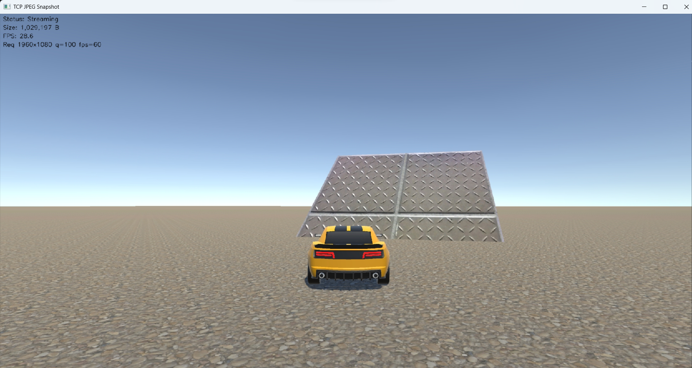
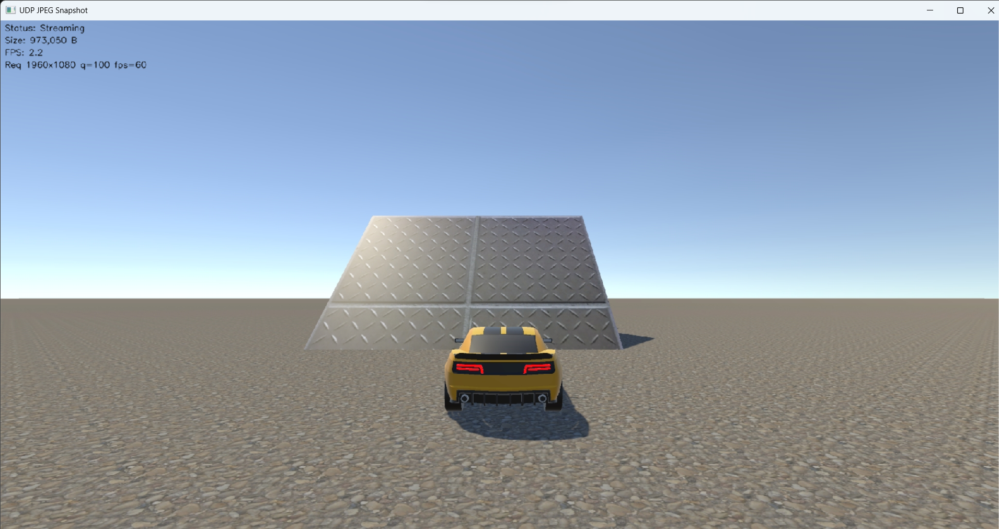
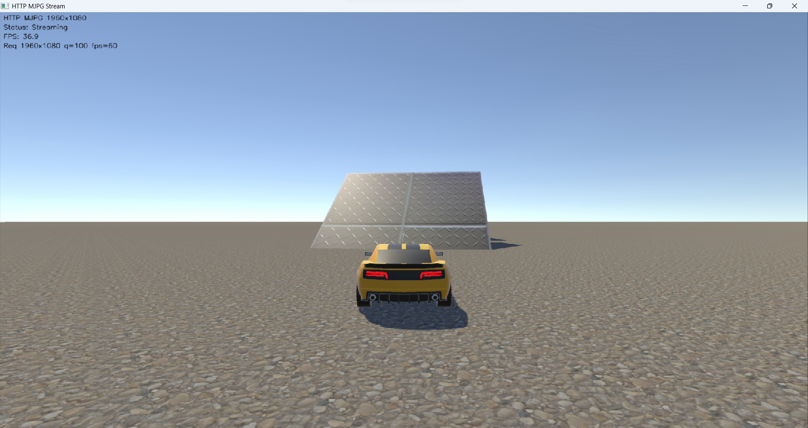

# Transport comparison: TCP vs UDP vs HTTP

Same task in three transports. Same request parameters in every screenshot:
**1920x1080, q=100, fps=60** - a deliberate stress test, since 1080p at near-
lossless quality means roughly 1 MB of JPEG per frame.

Reference shots in [Comparison/imgs/](Comparison/imgs/).

## Results

| Transport | Achieved FPS | Per-frame size | % of target (60 fps) |
|---|---:|---:|---:|
| HTTP / MJPEG stream | **36.5** | not measured | 61 % |
| TCP per-frame snapshot | 28.4 | ~1 020 KB | 47 % |
| UDP per-frame snapshot | 2.2 | ~372 KB (assembled) | 4 % |

| TCP | UDP | HTTP |
|---|---|---|
|  |  |  |

## Reading the screenshots

All three viewers show the same overlay layout (Status / [Size] / FPS / Req).
The HTTP viewer skips the Size readout - `cv2.VideoCapture` consumes the wire
bytes inside FFmpeg, so by the time Python sees a frame the original JPEG
length is gone. We could re-encode the decoded image to estimate it, but the
extra encode would itself increase artificially the time per frame at 1080p q=100 and downgrade the HTTP performance greatly, defeating the comparison. Better to leave HTTP's
size as "unknown".

## Why HTTP wins even though it runs on TCP

Even though HTTP generates more bytes on the wire due to its headers and multipart boundaries, HTTP/MJPEG here is a *continuous* multipart stream: the server keeps writing
`--frame\r\n…<jpg>\r\n` parts on a single long-lived connection, and the
client (via `cv2.VideoCapture`) just consumes them. There is no
per-frame request/response cycle.

The plain-TCP implementation, by contrast, is strict request/response. The
client sends a `snapshot?…\n` line and waits for the length-prefixed reply
before issuing the next request. Even on a fast LAN, that synchronization limits throughput. HTTP avoids that
entirely: frames are pushed as fast as the server's encoder produces them
and the client's decoder consumes them.

So the protocol design, especially at the application layer, matters more than the underlying transport. (raw TCP vs HTTP-over-TCP). The 30 %
throughput gap (36.5 vs 28.4) is the cost of synchronizing once per frame.

## Why UDP collapses

At 1920x1080 q=100, a single JPEG is around 1 MB. The UDP server fragments at
the application layer into 1200-byte chunks
([UdpJpegSnapshotServer.cs:55-56](UDP/UdpJpegSnapshotServer.cs:55)), which
gives **~875 datagrams per frame**. At 60 fps that is ~52 000 datagrams per
second.

Any one of the following discards the *entire* frame on the client:

- one chunk dropped by a kernel buffer or NIC queue,
- one chunk reordered past the 1-second assembly timeout
- the receive loop missing the deadline while decoding the previous frame.

The 2.2 fps figure measures only **fully-assembled** frames. The 372 KB
average size is *survivor bias*: simpler scenes produce smaller JPEGs with
fewer chunks, and those are statistically more likely to arrive intact, so
they dominate the rare successes.

UDP is an inherently efficient transport protocol. However, its performance degrades significantly under heavy application-layer fragmentation.
Drop the resolution and quality so a frame fits in one datagram (≤ ~64 KB)
and the gap closes sharply. Try `--w 360 --h 240 --q 70 --fps 30`: a frame
becomes smaller, fragmentation disappears, and UDP keeps up.

## Takeaways

- **Stream shape matters more than transport** when frames are large. A
  continuous push beats per-frame request/response by a clear margin (≈30 %
  here, and the gap widens with resolution).
- **UDP without application-level recuperation is fragile.** Loss probability
  scales with chunk count, and one lost chunk costs a whole frame.
- **For interactive control commands UDP is still excellent.** The control
  payload is small and fits in one datagram, so the fragmentation issue
  doesn't apply. That's why all three implementations keep a separate
  control channel and why the UDP control channel works even when the
  UDP video channel performance is really bad with high resulation + FPS images.
